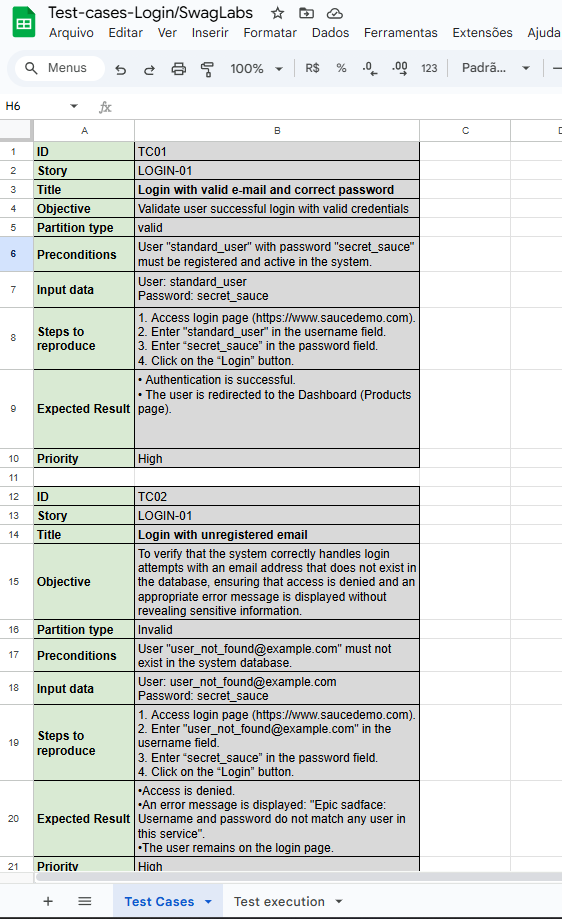
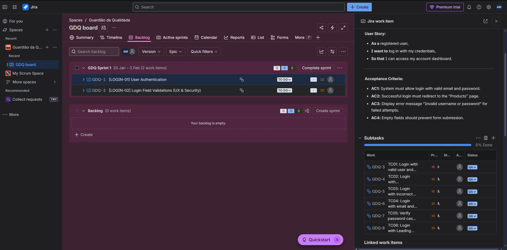
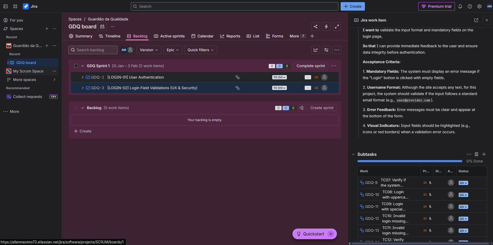

# 📋 Test Cases - Login System

This folder contains the test documentation for the authentication system, organized by User Stories.

## 🧠 Applied Techniques
To ensure high test coverage with efficiency, I used:
* **Equivalence Partitioning:** Applied to validate email formats (valid vs. invalid) and character types.
* **Boundary Value Analysis:** Used to test password length constraints (7, 8, 16, and 17 characters).

## 📂 Documentation
The complete set of test cases covers:
* **Happy Path:** Successful login with standard and uppercase emails.
* **Exception Paths:** Incorrect passwords, non-existent users, and empty fields.
* **UI/UX Validation:** Verification of error messages and visual indicators (red borders).

### Preview:

> 🔗 [Click here to open the Spreadsheet file](./test-cases-Login.pdf)

## ⚙️ Test Management & Methodology
For project management and traceability, I used **Jira**, applying Agile concepts (Scrum).

* **User Stories:** Defined with clear acceptance criteria (AC).
* **Traceability:** Each Test Case is linked as a subtask to its respective User Story, ensuring 100% requirements coverage.

